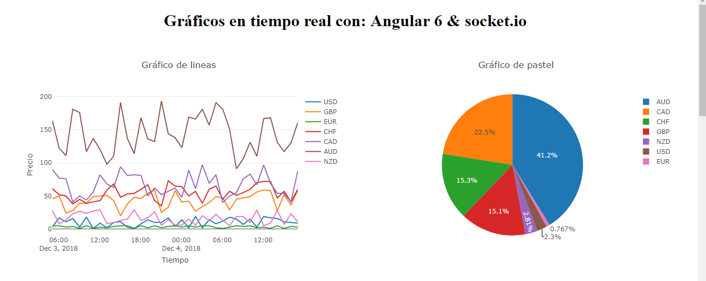
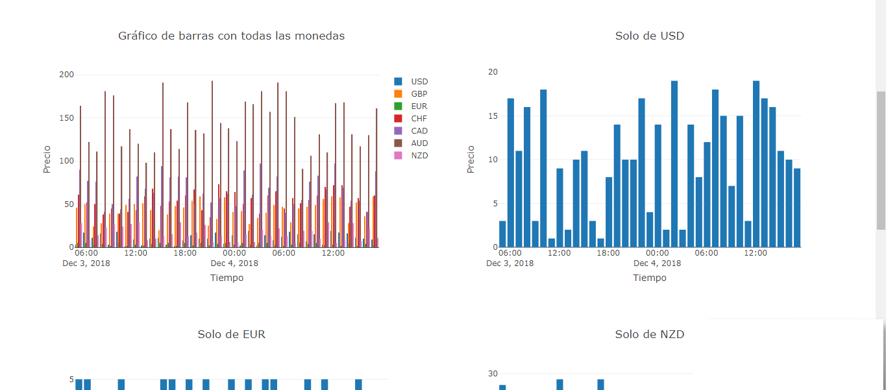
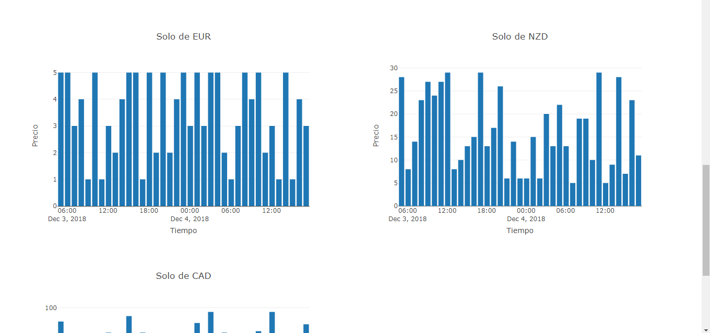
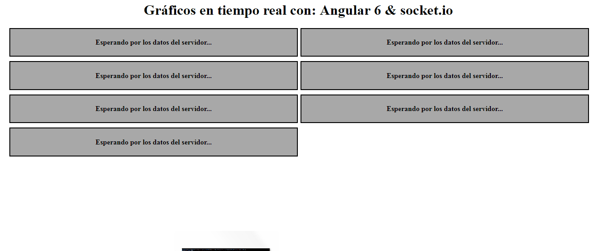

# Gráficos en tiempo real con: Node+Angular6+Socket.io+Plotly.js

## Visión general 

Las aplicaciones con elementos que se actualizan en tiempo real, son cada vez más comunes y podría decirse que esta característica es en ciertos casos hasta necesarias. Es por ello que con esta práctica busco emular una aplicación con gráficos que se actualizan en tiempo real. Para ello utilizo Node + Socket.io en el servidor y Angular6 + Socket.io (si, otra vez) en el lado del cliente.

## Instalación

1) Abrir dos consolas, en la primera ingresamos a la carpeta del cliente llamada “monedas”:

```
$ cd ./monedas
$ npm install
$ ng s -o
```
2) En la segunda ingresamos a la carpeta del servidor con el nombre de “node_server”:

```
$ cd ./node_server
$ npm install
$ node index.js
```
Capturas 



